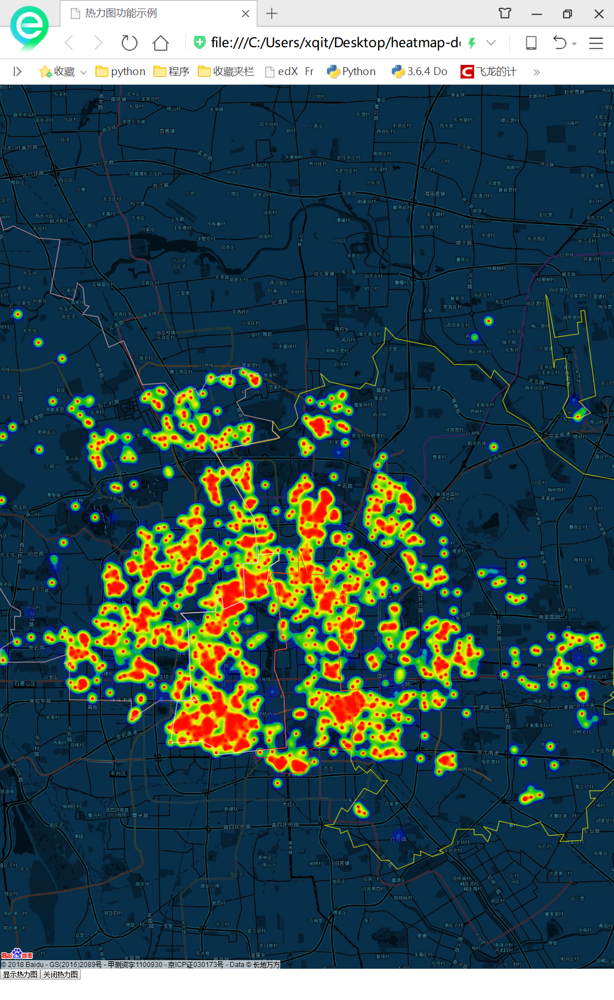

# second-hand_houses_spider
最新用`requests->bs->re'学的写了一个爬虫，爬了某家二手房网站，并调用百度API得到房源坐标，依据带看次数和关注人数加权平均后计算count数值绘制热力图。当然还可以调整程序用房价或其他信息作为基准绘制热力图，只需简单更改一下程序即可。

* 需更新 `def getlocation(name):`中`ak`,到百度去申请密钥（heatmap-demo.html 中有一个密钥可以用）；
* 地图中按行政区进行了分区，方便查看；
* 默认配置为北京市，直接修改TARGETDIST的区域（中文）即可爬其它区域；
* 如需爬其他城市请修改main中的url格式；
* html中可设置地图显示的style，百度自带的模板效果；
* 热力图：

新手贴～大神轻拍~估计没人看～～哈
